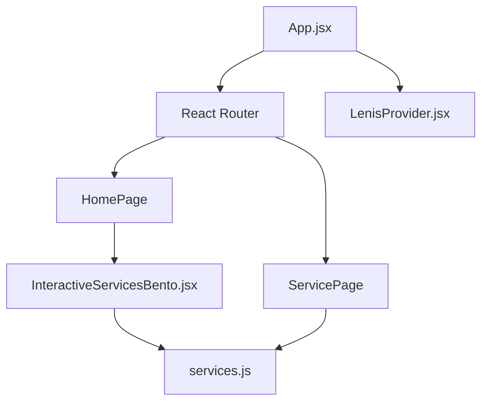

# Workshift Landing Page Wiki 🏗️

Welcome to the internal documentation for the Workshift landing page project.

## 🚀 Onboarding Guide

### 💎 Principal-Level Architectural Insight
The core philosophy of this project is **"Vibe-First, Agent-Compatible Architecture"**. It utilizes a decoupled data layer (`src/data/`) to drive interactive UI components through a centralized routing system.

**Core Pattern (Pseudocode in Python):**
```python
# Data-driven component strategy
class ServiceView:
    def render(self, service_id):
        data = get_service_data(service_id)
        return RenderBento(data)
```

**Architecture Overview:**


---

### 🛤️ Zero-to-Hero Learning Path

**Part I: Tech Foundations**
- **React 18 + Vite**: Fast HMR and modern JSX patterns.
- **GSAP & Framer Motion**: Used for high-end typographic animations and scroll-triggered effects. 
- **Vanilla CSS + Tailwind Utilities**: Hybrid styling approach.

**Part II: Domain Model**
- **Services**: Defined in `src/data/services.js`. Each service supports an "expanded" bento view and a dedicated subpage.
- **Blog**: Defined in `src/data/blogPosts.js`. Standard slug-based routing.

**Part III: Contribution**
1. Ensure `python3` is installed for utility scripts.
2. Run `npm run dev` to start the local environment.
3. Use `AGENT_CONTEXT.md` for AI-assisted development.

---

## 🏛️ Architecture & Deep Dive

### 🎨 Presentation Layer
- **Components**: `src/components/`
  - `HeroTypographic.jsx`: Split-text reveal animations.
  - `InteractiveServicesBento.jsx`: The primary "Service Bento" with deep-linking support.
  - `Header.jsx` & `FooterAndMisc.jsx`: Global navigation.
- **Pages**: `src/pages/`
  - `ServicePage.jsx`: Dynamic service detail view with SEO.
  - `BlogListPage.jsx` & `BlogPostPage.jsx`: CMS-style blog engine.

### ⚙️ Logic & Data
- **Data Stores**: `src/data/`
  - `services.js`: Source of truth for all service types, IDs, and visual metadata.
  - `blogPosts.js`: Markdown-compatible content objects.
- **Utilities**: `src/utils/`
  - `cn.js`: Tailwind class merging utility.
  - `webgl.js`: Helpers for 3D/Canvas effects (e.g., `HeroParticleSphere.jsx`).

### 🛠️ Infrastructure
- **Vite Config**: `vite.config.js`
- **Animations**: `LenisProvider.jsx` (Smooth scroll) and `gsap.js` integrations.

---

## 📚 Quick Reference & Glossary
- **Bento**: The modular grid layout used for services.
- **RAG (Knowledge Context)**: Referenced in `agenty` service data.
- **magnetic**: A component wrapper for interactive hover effects.

---

*WIKI Generated on 2026-04-21*
